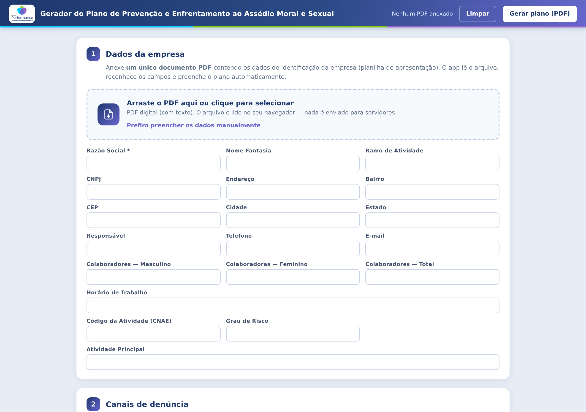

# Gerador do Plano de Prevenção e Enfrentamento ao Assédio Moral e Sexual

Aplicação de página única do **Grupo Performance — Medicina e Segurança do Trabalho** que lê os
dados de identificação da empresa a partir de um PDF, permite escolher os canais de denúncia e
emite o Plano de Prevenção e Enfrentamento ao Assédio pronto para impressão/exportação em PDF.



## Destaques

- **100% client-side.** O PDF anexado é lido no navegador via `pdf.js`; nenhum arquivo é enviado
  para servidores.
- **Artefato único e autocontido.** `index.html` embute CSS, logo (data URI), `pdf.js`, o worker do
  `pdf.js`, o extrator e a aplicação. Funciona offline, por `file://`, sem build no cliente.
- **Extração tolerante a PDFs "sujos".** O extrator normaliza codificações corrompidas comuns em
  documentos PT-BR gerados no Word (`«`→`ç`, `√`→`Ã`, `Á`→`Ç`, `⁄`→`Ú`, `„`→`ã` …) e lida com
  layouts de formulário variados (rótulo e valor na mesma linha, em linhas separadas ou em branco).
- **Preenchimento manual como alternativa** caso o PDF seja digitalizado (imagem) ou ilegível.
- **Sessão preservada** em `localStorage` entre recarregamentos.

## Como usar

1. Abra `index.html` no navegador (ou acesse a página publicada).
2. **Etapa 1 — Dados da empresa:** arraste o PDF da planilha de apresentação. Os campos
   (Razão Social, CNPJ, endereço, responsável, nº de colaboradores, CNAE, grau de risco…) são
   reconhecidos e preenchidos automaticamente. Também é possível preencher manualmente.
3. **Etapa 2 — Canais de denúncia:** marque os canais que a empresa disponibilizará e informe os
   dados de contato. Há um campo livre para um canal personalizado.
4. **Etapa 3 — Histórico de revisões:** a capa sai com a linha da elaboração (Rev. 00). Para
   cada atualização, clique em **+ Adicionar revisão**: o app gera a linha seguinte (Rev. 01, 02,
   03…) com número, data e motivo (histórico) informados, e o número da última revisão passa a
   constar no cabeçalho de todas as páginas.
5. Clique em **Gerar plano (PDF)**, confira a pré-visualização e imprima/salve como PDF.

## Estrutura do repositório

```
.
├── index.html              # ARTEFATO GERADO — app autocontido (não editar à mão)
├── site/index.html         # cópia idêntica usada no deploy
├── build.py                # monta o artefato a partir das fontes
├── build/
│   ├── template.html       # casca HTML + CSS, com tokens de substituição
│   └── app.js              # lógica da aplicação (UI, validação, montagem do documento)
├── assets/
│   ├── logo.png            # logo embutida como data URI
│   ├── extract.js          # extrator de dados do PDF (universal: browser e Node)
│   ├── pdf.min.js          # vendor — pdf.js
│   └── pdf.worker.min.js   # vendor — worker do pdf.js
├── docs/screenshots/       # capturas de tela da interface
└── samples/                # PDFs de referência (entradas e saídas de exemplo)
```

> ⚠️ **`index.html` e `site/index.html` são gerados.** Edite `build/template.html`, `build/app.js`
> ou os arquivos em `assets/` e rode o build — alterações feitas direto no HTML gerado serão
> perdidas na próxima execução.

## Build

O build é um script Python sem dependências externas. Ele substitui os tokens
`{{LOGO}}`, `{{PDFJS}}`, `{{WORKER}}`, `{{EXTRACT}}` e `{{APP}}` do template pelo conteúdo
correspondente e grava o resultado em `index.html` e `site/index.html`.

```bash
python3 build.py          # regenera os artefatos
python3 build.py --check  # verifica se os artefatos estão em dia (não escreve) — ideal para CI
```

Equivalentes via npm:

```bash
npm run build
npm run build:check
```

O script aborta se alguma fonte estiver ausente, se algum bloco inline contiver `</script`
(o que encerraria o `<script>` prematuramente) ou se sobrar algum token não substituído.

### Servidor local

```bash
npm start   # http://localhost:8080
```

## Desenvolvimento

As dependências npm (`pdfjs-dist`, `jsdom`, `puppeteer`) são **apenas de desenvolvimento** — o app
publicado não carrega nada do `node_modules`, pois as bibliotecas já estão embutidas no artefato.

```bash
npm install
```

Para atualizar o `pdf.js`, copie os arquivos distribuídos do pacote para `assets/` e rode o build:

```bash
cp node_modules/pdfjs-dist/build/pdf.min.js        assets/pdf.min.js
cp node_modules/pdfjs-dist/build/pdf.worker.min.js assets/pdf.worker.min.js
npm run build
```

### Testes

Ainda **não há suíte automatizada** (`npm test` falha propositalmente). As dependências necessárias
já estão declaradas:

- **`jsdom`** — `assets/extract.js` é um módulo UMD e pode ser importado direto no Node
  (`require('./assets/extract.js')`) para testar a extração sem navegador.
- **`puppeteer`** — para testes ponta a ponta da geração do documento.

Os arquivos em `samples/` servem como fixtures para esses testes.

## Publicação

`index.html` na raiz é servido pelo GitHub Pages. `site/index.html` é mantido como cópia idêntica
do mesmo artefato; o build grava os dois simultaneamente, então nunca saem de sincronia.

## Licença

Uso interno do Grupo Performance. Todos os direitos reservados.
